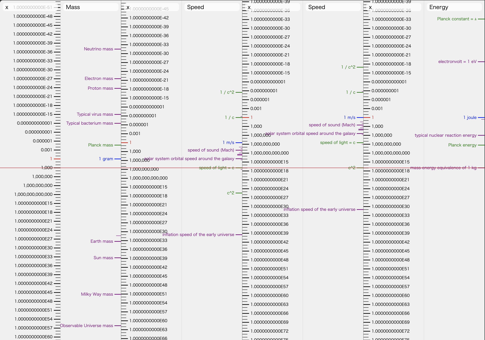
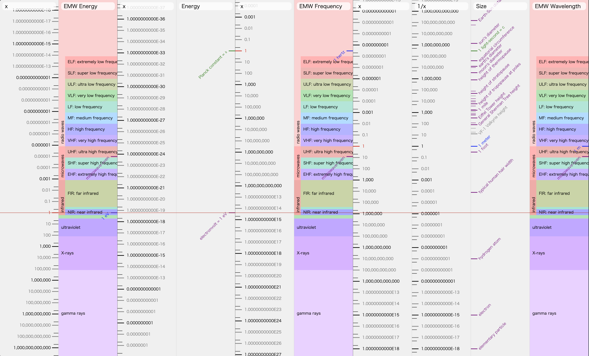

# Smart Rule

This is a smart slide rule web application that covers everything from overviews to detailed numbers through a combination of logarithmic representation and zoom. Various datasets are also available, which can be used for overview or calculations as they are.

## ▶️ Live Site

<a href="https://wraith13.github.io/smart-rule/">
 
https://wraith13.github.io/smart-rule/
</a>

> [!WARNING]
> UNDERCONSTRUCTION

## 🎖️ Feature

- ✅ Save as SVG image
- ✅ Save as PNG image
- ✅ Number format settings: Thousands separator, Exponential notation, Adjust exponent to multiple of 3
- ✅ Datasets: size, area, volume, mass, time, speed, energy, temperature, counting, sound frequency, EMW wavelength, EMN frequency, EMV energy, history
- ✅ Multi-language support: English(en), 日本語(ja)

## 📷 Screenshot

𝐸=𝑚𝑐²

ElectroMagnetic Wave

## ⚖️ License

[Boost Software License](./LICENSE_1_0.txt)
